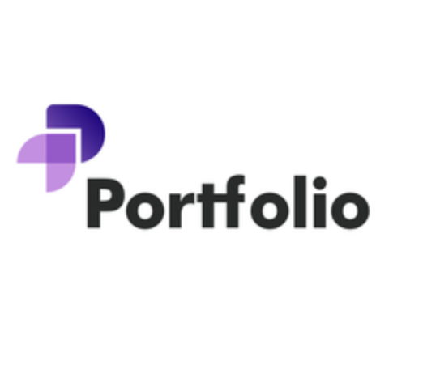
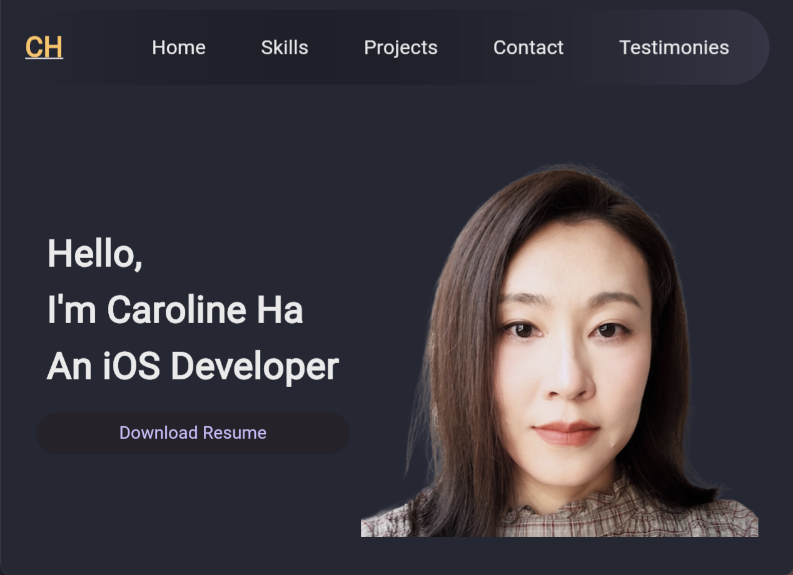

<!-- PROJECT LOGO -->
 

  

  <h3 align="center">my_portfolio</h3>

  

    A new Flutter project to jumpstart my career!
     
     
  

<!-- TABLE OF CONTENTS -->

  
Table of Contents

  <ol>
    <li>
      <a href="#about-the-project">About The Project</a>
      <ul>
        <li><a href="#built-with">Built With</a></li>
      </ul>
    </li>
        <li><a href="#contact">Contact</a></li>
    <li>
      <a href="#getting-started">Getting Started</a>
    </li>
    <li><a href="#development-method">Development Method</a></li>
    <li><a href="#reference">Reference</a></li>
    <li><a href="#license">License</a></li>
    <li><a href="#server-code">Server Code</a></li>
  </ol>

<!-- ABOUT THE PROJECT -->
## About The Project

 

  
  

 

Welcome to Caroline Ha's Personal Portfolio!

As a student enrolled in CPSC362, I am delighted to present my portfolio, a culmination of my academic journey and passion for software development. Within these virtual pages, you'll find a curated collection of my professional bio, skills, project portfolio, and contact information.

With a commitment to excellence in every endeavor, this portfolio serves as both a showcase of my skills and a testament to my dedication to the field of software development. As part of my coursework for CPSC362, this portfolio represents a milestone in my academic and professional growth. By showcasing my projects and experiences, I aim to demonstrate my proficiency in software development and highlight the knowledge gained throughout the course.

Thank you for visiting, and I hope you enjoy exploring my portfolio as much as I've enjoyed creating it.

<!-- CONTACT -->
## Contact

Name: Caroline Ha

email: carolineh@csu.fullerton.edu

CWID: 885136382

(<a href="#readme-top">back to top</a>)

### Built With

This section lists the major frameworks used to bootstrap my project. 

* Flutter
* Dart
* JaveScript

(<a href="#readme-top">back to top</a>)

<!-- GETTING STARTED -->
## Getting Started

This is the deployed link for my project - https://myportfolio-ch.web.app/

<!-- DEVELOPMENT METHOD -->
## Development Method

Agile Methodology
incremented prototype 

(<a href="#readme-top">back to top</a>)

<!-- REFERENCE -->
## Reference

Flutter Web Tutorial - Build Portfolio Website in Flutter #flutterweb by Shohruh AK
https://www.youtube.com/watch?v=JTUULMFyXdc&list=PLyfGAIknOAuRCyNQerjnQhzsZyt4mpEmj

(<a href="#readme-top">back to top</a>)

<!-- LICENSE -->
## License

Distributed under the MIT License. See `LICENSE.txt` for more information.

(<a href="#readme-top">back to top</a>)

<!-- Server Code -->
## Server Code

This is the Server code designed run on the localhost for mocking email receiving.

const express = require('express');
const app = express();
const PORT = 3000;

// Middleware to parse JSON bodies
app.use(express.json());

app.post('/send-email', (req, res) => {
    // Simulate sending email (replace with actual logic)
    // Print the body received from the client
    console.log('Received body:', req.body);

    // Extract name, email, and message from the request body
    const { name, email, message } = req.body;

    // Print name, email, and message
    console.log('Name:', name);
    console.log('Email:', email);
    console.log('Message:', message);
    console.log('Email sent successfully');

    res.sendStatus(200);
});

app.listen(PORT, () => {
    console.log(`Portofolio Mock email server is running on http://localhost:${PORT}`);
});

(<a href="#readme-top">back to top</a>)

